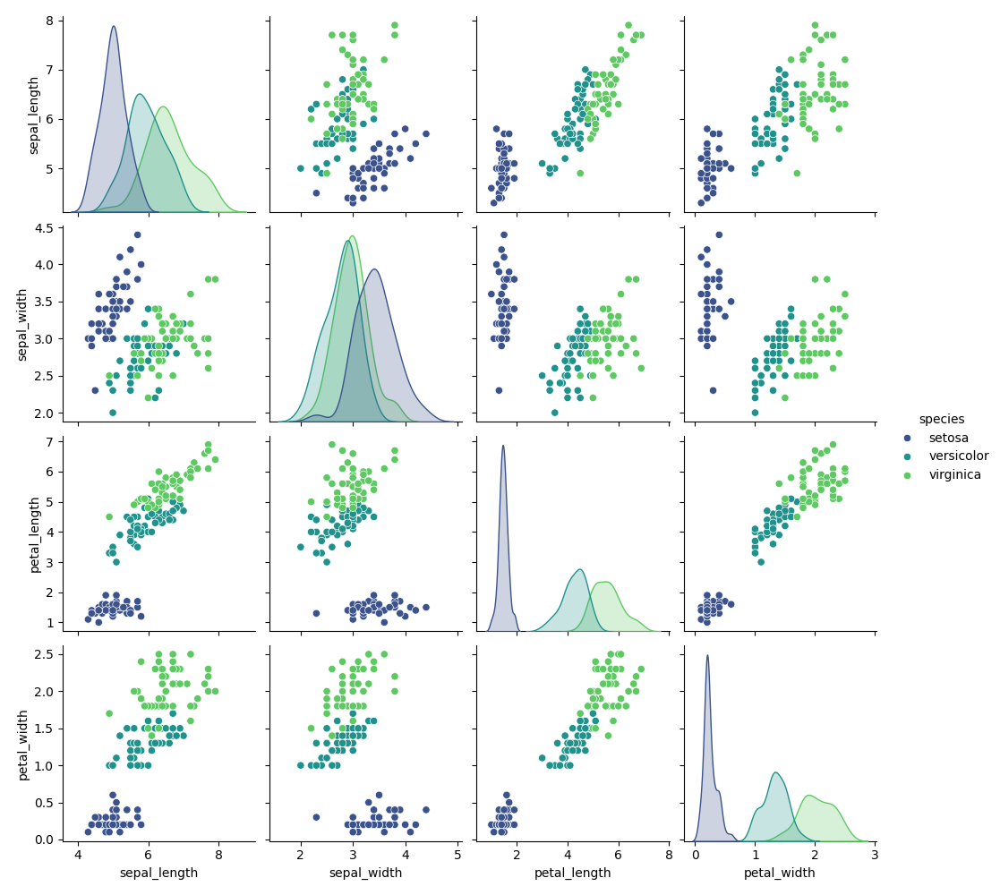
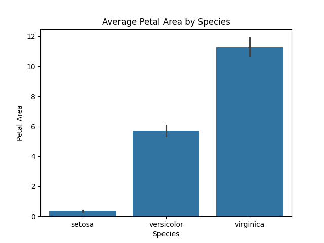
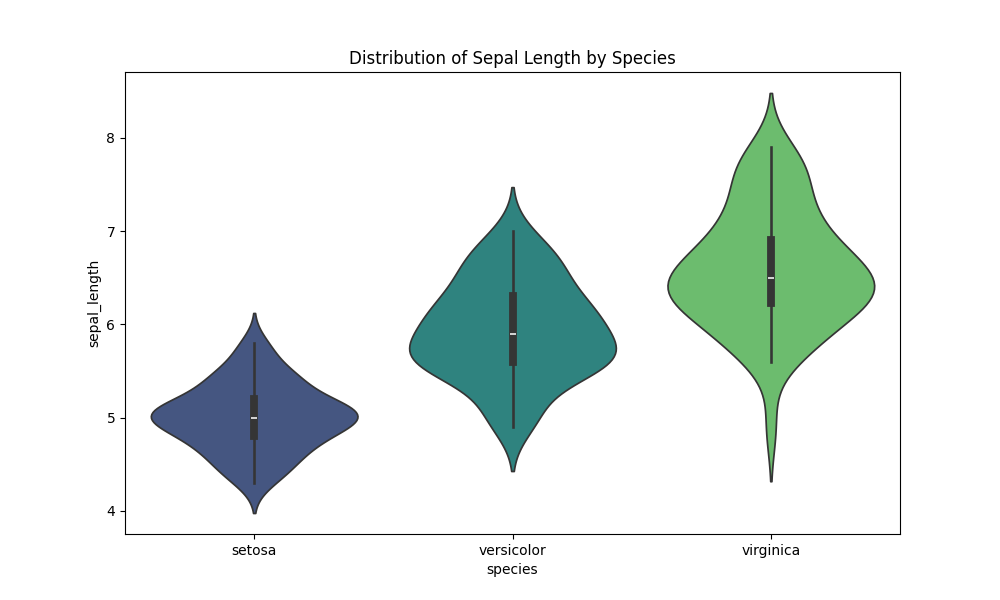
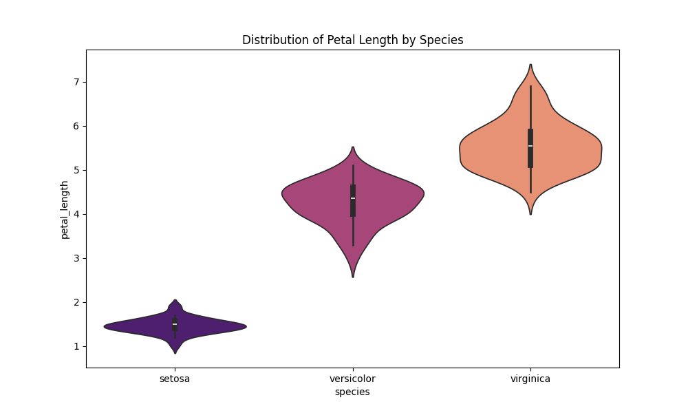

# jf361_ids706_mp9
[](https://github.com/siyiia/jf361_ids706_mp9/actions/workflows/cicd.yml)

## Project Introduction
This project is to demonstrate data manipulation using Cloud-Hosted Notebook.


## Project Requirments
- Set up a cloud-hosted Jupyter Notebook (e.g., Google Colab)
- Perform data manipulation tasks on a sample dataset

## Google Colab Link
https://colab.research.google.com/drive/1SGLO9A0qZGhlPFfwZvS_CPttPhq8ttMr?usp=sharing

## Setup and Usage
1. Open the provided Google Colab link to access the notebook.
2. Ensure that the required libraries are installed (`pandas`, `matplotlib`, `seaborn`).

## Project Description
- Data Loading: Loads the Iris dataset from an online URL.
- Basic Exploration: Displays dataset statistics and structure.
- Feature Engineering: Adds derived features for better insights.
- Data Visualization: Generates visualizations to explore patterns in the data.

## Project Contents
1. **Load data**:

    The Iris dataset is loaded directly from a public URL: https://raw.githubusercontent.com/mwaskom/seaborn-data/master/iris.csv
2. **Display Basic Information**:

    Display some basic information of the dataset. For example, 
    ```python
    data.head()
    ```
    **First 5 rows of data:**
    | sepal_length | sepal_width | petal_length | petal_width | species |
    |--------------|-------------|--------------|-------------|---------|
    | 5.1          | 3.5         | 1.4          | 0.2         | setosa  |
    | 4.9	         | 3.0	       | 1.4	        | 0.2         |	setosa  |
    | 4.7	         | 3.2	       | 1.3	        | 0.2         |	setosa  |
    | 4.6	         | 3.1	       | 1.5	        | 0.2         |	setosa  |
    | 5.0	         | 3.6	       | 1.4	        | 0.2         |	setosa  |
    
    To view the column names:
    ```python
    data.columns
    ```
    Output:
    ```
    Index(['sepal_length', 'sepal_width', 'petal_length', 'petal_width',
       'species'],
      dtype='object')
    ```
3. **Data Analysis**:
    
    This section covers basic data analysis steps:
    - Check for Missing Values
    - Print Basic Statistics
    - Print the Number of Classes
    
    Example code:
    ```python
    print("Missing values in each column:\n", data.isnull().sum())
    print("\nBasic statistics:\n", data.describe())
    print("\nNumber of classes in the dataset:", data['species'].nunique())
    ```

4. **Process data**:

    Generate a new feature, `petal_area`, by multiplying the `petal_length` and `petal_width`. Additionally, map each flower species (class name) to a numerical value for easier handling in future analyses.
5. **Visualise the dataset**:

    create visualizations to explore relationships and distributions in the dataset:

    - Pairplot of Sepal and Petal Dimensions by Species
      <p>
        
      </p>

    - Average Petal Area by Species
      <p>
        
      </p>

    - Distribution of Sepal Length by Species
      <p>
        
      </p>

    - Distribution of Petal Length by Species
      <p>
        
      </p>